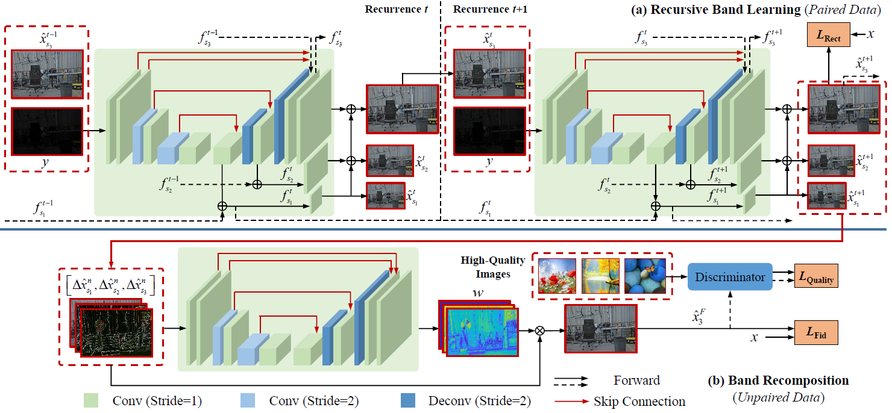

## From Fidelity to Perceptual Quality: A Semi-Supervised Approach for Low-Light Image Enhancement (CVPR'2020)

[Wenhan Yang](https://flyywh.github.io/index.html), [Shiqi Wang](https://www.cs.cityu.edu.hk/~shiqwang/), [Yuming Fang](https://sites.google.com/site/leofangyuming/), Yue Wang and [Jiaying Liu](http://www.icst.pku.edu.cn/struct/people/liujiaying.html) 

[[Paper Link]](http://openaccess.thecvf.com/content_CVPR_2020/papers/Yang_From_Fidelity_to_Perceptual_Quality_A_Semi-Supervised_Approach_for_Low-Light_CVPR_2020_paper.pdf) [[Project Page]](https://github.com/flyywh/CVPR-2020-Semi-Low-Light) [[Slides]]()(TBA)[[Video]]()(TBA) (CVPR'2020 Poster)

### Abstract

Under-exposure introduces a series of visual degradation, i.e. decreased visibility, intensive noise, and biased color, etc. To address these problems, we propose a novel semi-supervised learning approach for low-light image enhancement. A deep recursive band network (DRBN) is proposed to recover a linear band representation of an enhanced normal-light image with paired low/normal-light images, and then obtain an improved one by recomposing the given bands via another learnable linear transformation based on a perceptual quality-driven adversarial learning with unpaired data. The architecture is powerful and flexible to have the merit of training with both paired and unpaired data. On one hand, the proposed network is well designed to extract a series of coarse-to-fine band representations, whose estimations are mutually beneficial in a recursive process. On the other hand, the extracted band representation of the enhanced image in the first stage of DRBN (recursive band learning) bridges the gap between the restoration knowledge of paired data and the perceptual quality preference to real high-quality images. Its second stage (band recomposition) learns to recompose the band representation towards fitting perceptual properties of highquality images via adversarial learning. With the help of this two-stage design, our approach generates the enhanced results with well reconstructed details and visually promising contrast and color distributions. Extensive evaluations demonstrate the superiority of our DRBN.

#### If you find the resource useful, please cite the following :- )

```
@InProceedings{Yang_2020_CVPR,
author = {Yang, Wenhan and Wang, Shiqi and Fang, Yuming and Wang, Yue and Liu, Jiaying},
title = {From Fidelity to Perceptual Quality: A Semi-Supervised Approach for Low-Light Image Enhancement},
booktitle = {IEEE/CVF Conference on Computer Vision and Pattern Recognition (CVPR)},
month = {June},
year = {2020}
}
```
 

## Installation:

1. Clone this repo
2. Install PyTorch and dependencies from http://pytorch.org 
3. For stage II training, you need to download https://download.pytorch.org/models/vgg16-397923af.pth and put it in DRBL-stage2/src/.
4. For testing, you can directly run test.sh in DRBL-stage1/src/ and DRBL-stage2/src/.
5. For training, you can directly run train.sh in DRBL-stage1/src/ and DRBL-stage2/src/.
6. You can download our dataset here: https://pan.baidu.com/s/149C65GCvg4lVKLDQqFdvqw (extracted code: 22im) [Partly updated on 27 March]

（**Note**: the code is suitable for PyTorch 0.4.1）

## Detailed Guidance:

Thank you for your attention and sorry for that I did not well treat you. It will change and you can obtain a timely response now.

1. How could I reproduce the objective evaluation results in Table I in the paper？
You can run sh ./DRBL-stage1/src/test.sh
The 1st stage offers better objective results while the other produces better overall subjective visual quality.
In our paper, the methods involved in objective comparisons are not trained with adversarial/quality losses.

2. Data structure
You can see src\data\lowlight.py and src\data\lowlighttest.py for those details in the code of each stage.

In the 1st stage:
hr --> normal-light images, lr --> low-light images
lr and hr are paired.

In the 2nd stage:
hr --> normal-light images, lr --> low-light images
lr and hr are paired.
lrr --> low-light images in the real applications, hq --> high quality dataset

3. Dataset
You can obtain the dataset via: https://pan.baidu.com/s/149C65GCvg4lVKLDQqFdvqw (extracted code: 22im) [Partly updated on 27 March]

We introduce these collections here:
1) Our_low: real captured low-light images in LOL for training;
2) Our_normal: real captured normal-light images in LOL for training;
3) Our_low_test: real captured low-light images in LOL for testing;
4) Our_normal_test: real captured normal-light images in LOL for testing;
5) AVA_good_2: the high-quality images selected from the AVA dataset based on the MOS values
6) Low_real_test_2_rs: real low-light images selected from LIME, NPE, VV, DICM, the typical unpaired low-light testing datasets.
7) Low_degraded: synthetic low-light images in LOL for training;
7) Normal: synthetic normal-light images in LOL for training;

4. Image number in LOL
LOL: Chen Wei, Wenjing Wang, Wenhan Yang, and Jiaying Liu. "Deep Retinex Decomposition for Low-Light Enhancement", BMVC, 2018.
LOL-v2 (the extension work): Wenhan Yang, Haofeng Huang, Wenjing Wang, Shiqi Wang, and Jiaying Liu. "Sparse Gradient Regularized Deep Retinex Network for Robust Low-Light Image Enhancement", TIP, 2021.

We use LOL-v2. In fact, it is quite unexpected and frustrated that the work of LOL-v2 is published later than this, which might also bother follower.
I think you can choose which one to follow freely.

5. Pytorch version
Only 0.4 and 0.41. If you have to use more advanced versions, which might be constrained to the GPU device types, you might access this companion for the idea to replace parts of the dataloader: 

6. Why does stage 2 have two branches?
The distributions of LOL and LIME, NPE, VV, DICM are quite different.
We empirically found that it will lead to better performance if two models and the corresponding training data are adopted.

## Contact

If you have questions, you can contact `yangwenhan@pku.edu.cn`.
A timely response is promised, if the email is sent by your affliaton email with your signed name.
